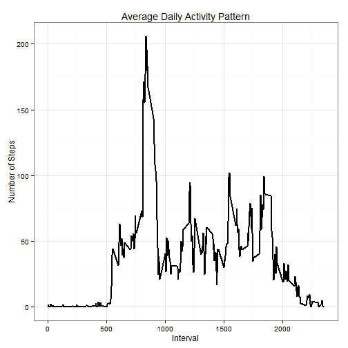
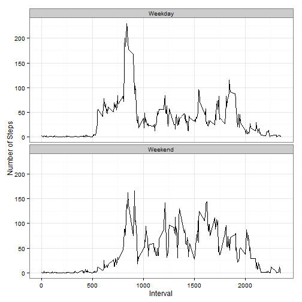

# Reproducible Research: Peer Assessment 1
by Artem Kachugin

## Basic settings

I have russian version of RStudio, that is why in order to get proper date names I have to use following piece of code:


```r
Sys.setlocale("LC_TIME", "English")
```

Also as required I set echo=TRUE to make all the code visible:


```r
echo = TRUE
```

Finally I upload libraries (which must be preinstalled):


```r
library(ggplot2)
```

## Loading and preprocessing the data

NOTE: set a working directory containing the data for the assignment.


```r
unzip("activity.zip")
activity <- read.csv("activity.csv", 
                     colClasses = c("integer", 
                                    "Date", 
                                    "factor")
                     )
```

## What is mean total number of steps taken per day?

Sum steps per day:


```r
stepsPerDay <- tapply(activity$steps, activity$date, sum, na.rm=TRUE)
```

Use the result for making a histogram:


```r
qplot(stepsPerDay, xlab="Total Number of Steps Taken Each Day", ylab = "Number of Days", binwidth=500)
```

 

Now let's count mean and median values of steps per day:


```r
mean <- mean(stepsPerDay)
median <- median(stepsPerDay)
```


- Mean 9354.2295082
- Median 10395


## What is the average daily activity pattern?

Take mean of steps by intervals and saving the data:


```r
stepsPerInterval <- aggregate(activity$steps, by = list(interval = activity$interval), FUN=mean, na.rm=TRUE)
```

Before plotting convert result to integers:


```r
stepsPerInterval$interval <- as.integer(levels(stepsPerInterval$interval)[stepsPerInterval$interval])
colnames(stepsPerInterval) <- c("interval", "steps")
```

Finally use the result for making a plot:


```r
ggplot(stepsPerInterval, aes(x=interval, y=steps)) +   
        geom_line(color="black", size=1) +  
        labs(title="Average Daily Activity Pattern", x="Interval", y="Number of Steps")
```

 

Which interval has max steps?


```r
stepsPerInterval[which.max(stepsPerInterval$steps), ]
```

```
##     interval    steps
## 272      835 206.1698
```

## Imputing missing values

How many NA's?


```r
NAs <- sum(is.na(activity))
```

- NA's: 2304

Now I will remove NA's using mean value for that 5-minute interval.


```r
fill.value <- function(steps, interval) {
    filled <- NA
    if (!is.na(steps)) 
        filled <- c(steps) else filled <- (stepsPerInterval[stepsPerInterval$interval == interval, "steps"])
    return(filled)
}
filled.data <- activity
filled.data$steps <- mapply(fill.value, filled.data$steps, filled.data$interval)
```

How many NA's now?


```r
newNAs <- sum(is.na(filled.data))
```

- NA's: 0


```r
total.steps <- tapply(filled.data$steps, filled.data$date, FUN = sum)
qplot(total.steps, binwidth = 1000, xlab = "Total Number of Steps per Day", ylab="Number of Days")
```

 


```r
mean <- mean(total.steps)
median <- median(total.steps)
```

- Mean 1.0766189 &times; 10<sup>4</sup>
- Median 1.0766189 &times; 10<sup>4</sup>

## Are there differences in activity patterns between weekdays and weekends?


```r
weekdays_steps <- function(data) {
    weekdays_steps <- aggregate(data$steps, by=list(interval = data$interval),
                          FUN=mean, na.rm=T)
    # convert to integers for plotting
    weekdays_steps$interval <- 
            as.integer(levels(weekdays_steps$interval)[weekdays_steps$interval])
    colnames(weekdays_steps) <- c("interval", "steps")
    weekdays_steps
}

data_by_weekdays <- function(data) {
    data$weekday <- 
            as.factor(weekdays(data$date)) # weekdays
    weekend_data <- subset(data, weekday %in% c("Saturday","Sunday"))
    weekday_data <- subset(data, !weekday %in% c("Saturday","Sunday"))

    weekend_steps <- weekdays_steps(weekend_data)
    weekday_steps <- weekdays_steps(weekday_data)

    weekend_steps$dayofweek <- rep("Weekend", nrow(weekend_steps))
    weekday_steps$dayofweek <- rep("Weekday", nrow(weekday_steps))

    data_by_weekdays <- rbind(weekend_steps, weekday_steps)
    data_by_weekdays$dayofweek <- as.factor(data_by_weekdays$dayofweek)
    data_by_weekdays
}

data_weekdays <- data_by_weekdays(filled.data)
```

Now we let's produce plot comparing weekend and weekday.


```r
ggplot(data_weekdays, aes(x=interval, y=steps)) + 
        geom_line(color="black") + 
        facet_wrap(~ dayofweek, nrow=2, ncol=1) +
        labs(x="Interval", y="Number of Steps") +
        theme_bw()
```

 

From the graph one can see that the weekday has a peak above 200, while steps during other intervals rarely exceed 100. On the other hand weekend doesn't have such a peak (no intervals exceed 170), though there are many points higher than 100.
